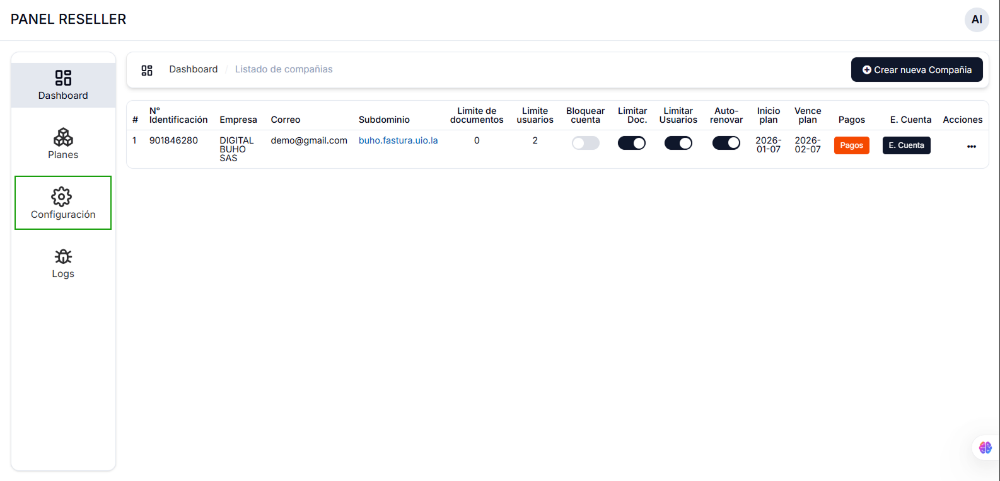
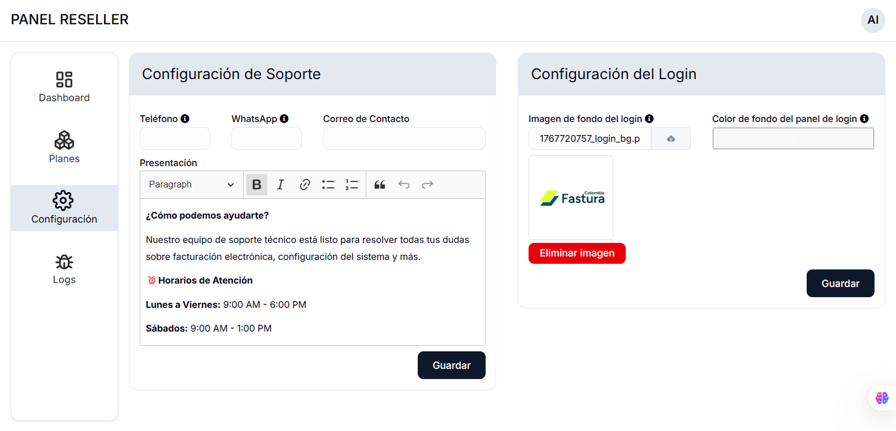
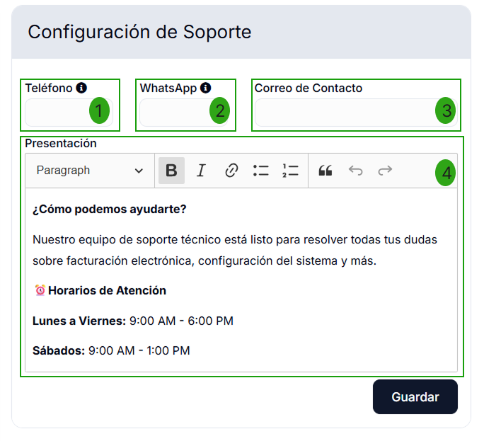
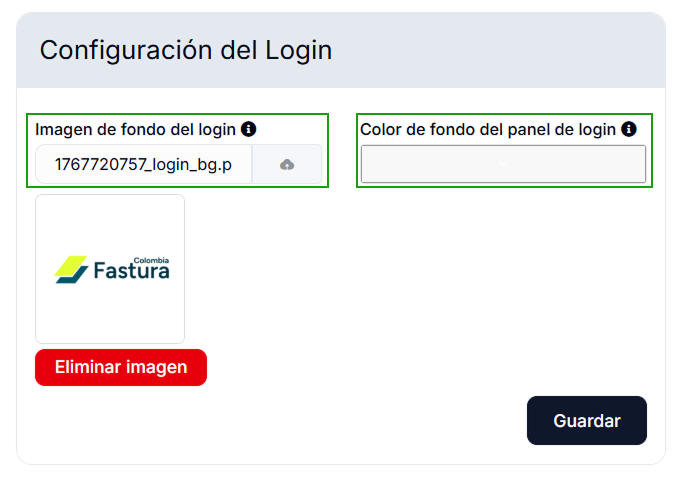

# Configuración

Para ingresar al módulo de **Configuración**, debe seleccionar la opción en la sección izquierda de su panel de administración.

## Panel de Configuraciones

Al entrar al módulo tendrá las siguientes opciones: **Configuración de Soporte** y **Configuración de Login**.

A continuación se explica el funcionamiento de cada una.

### Configuración de Soporte

Esta sección le permite personalizar la información de contacto y presentación del soporte técnico que verán sus clientes.

**Campos disponibles:**

1. **Teléfono**: Ingrese el número telefónico de contacto para soporte.

2. **WhatsApp**: Ingrese el número de WhatsApp para atención al cliente.

3. **Correo de Contacto**: Ingrese el correo electrónico destinado para consultas de soporte.

4. **Presentación**: Editor de texto enriquecido donde puede personalizar el mensaje de bienvenida y los horarios de atención. Puede aplicar formato al texto utilizando negritas, cursivas, listas y otros elementos de formato.

Una vez completados los campos, presione el botón **Guardar** para aplicar los cambios.

### Configuración del Login

Esta sección le permite personalizar la apariencia de la pantalla de inicio de sesión para sus clientes.

**Opciones disponibles:**

- **Imagen de fondo del login**: Cargue una imagen personalizada que se mostrará como fondo en la pantalla de inicio de sesión. El nombre del archivo aparecerá en el campo una vez cargado. Para eliminar la imagen, presione el botón **Eliminar imagen**.

- **Color de fondo del panel de login**: Defina un color personalizado para el panel de inicio de sesión ingresando un código hexadecimal o seleccionando un color desde el selector.

La vista previa muestra cómo se verá el logo en la pantalla de login.

Una vez realizados los ajustes deseados, presione el botón **Guardar** para aplicar los cambios.